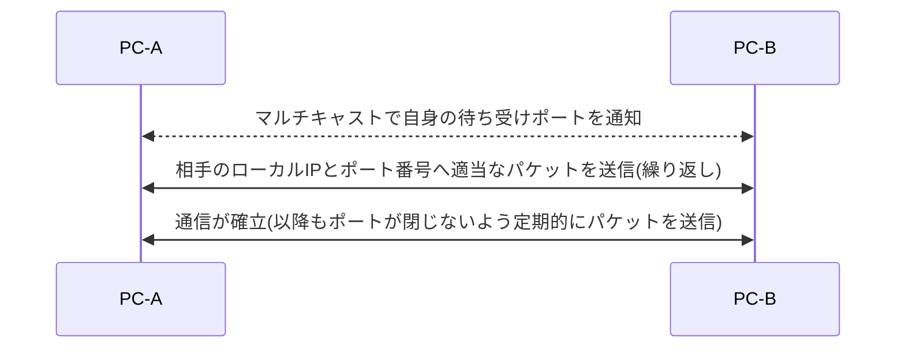
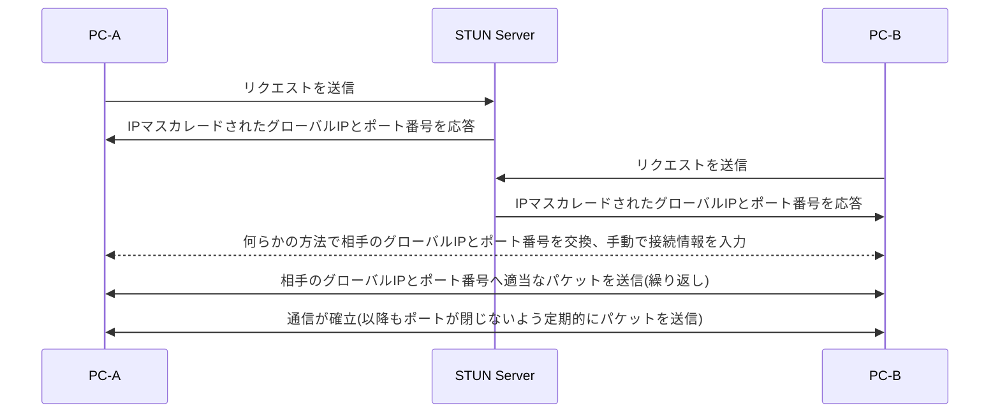

# java-udp-hole-punching-example
JavaでUDP hole punchingによるP2P通信を行うサンプルです。  
最も簡単な実装のため、Symmetric型のNATには未対応です。  
暗号化は未実装のため、機密情報は送信しないでください。  
マルチキャストが禁止されているなど、環境によっては正常に動作しない可能性があります。

# 動作イメージ(ローカル接続)

# 動作イメージ(リモート接続)

